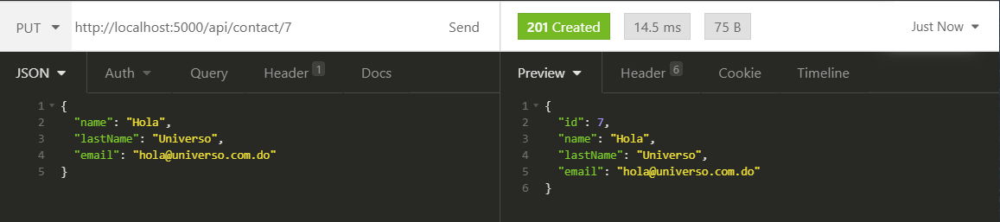

# Programming Test 1

Contacts API

### Data

  - [Entity Framework Core](https://docs.microsoft.com/en-us/ef/core/get-started/overview/first-app?tabs=netcore-cli)
  - InMemory Database Provider (To simplify running the app elsewhere)
  - Repository and Unit Of Work Patterns

### Backend

  - [ASP.NET Core](https://docs.microsoft.com/en-us/aspnet/core/?view=aspnetcore-5.0)
  - REST endpoint to manage "contacts"

## Demo

Run the demo.bat script or follow the steps bellow

## Build and run Backend

The Backend app must be running in order for the Frontend one to work.

Just Open the solution in VisualStudio, select the Backend project and run it.
Choose the 'Backend' launch profile (It has the right ports configured).

Or maybe publish it and get the executable at hand from the command line:

```batch
cd ProgrammingTest1
dotnet publish Backend -c Release -r win-x64 -o %USERPROFILE%/Desktop/Backend"
```

Then cd to the output folder (in this case the Desktop/Backend) and run the Backend.exe program.

## ScreenShots

### GET


### POST


### PUT



### DELETE


